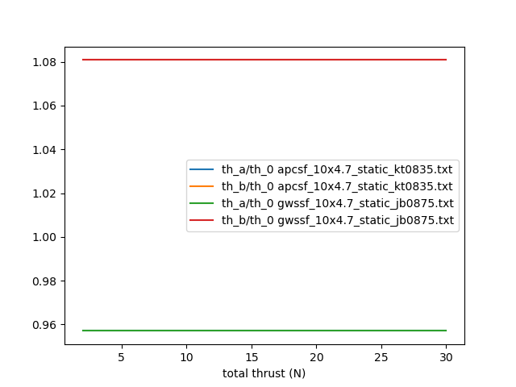
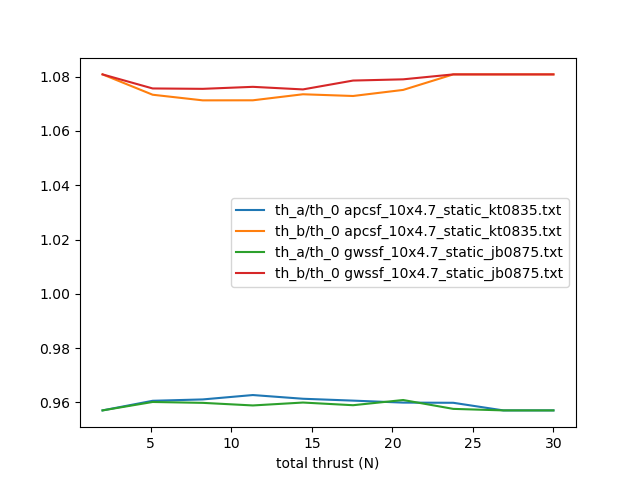

Airframe
========

Configuration
-------------

The chosen aircraft configuration is a tilt-rotor quadplane.
It is based on a 1.8m span RC glider modified to receive an arm on each wing.
Each arm is equipped with two motors. The front motors can tilt around the pitch axis.
The aerodynamics is pre-designed with `Link PredimRC <http://rcaerolab.eklablog.com/predimrc-p1144024>`_

Mechanical model
----------------

Battery-to-motor model
^^^^^^^^^^^^^^^^^^^^^^

In this section we provide the relationship between the motor rotation velocity and the throttle. This relationship depends on the battery, the ESC and the motor: $N = K_V \frac{U_0}{2000} th$ with $N$ the motor rotation velocity in $rpm$, $K_V$ a characteristic of the motor in $rpm/V$ and $U_0$ the battery voltage, assumed constant (its internal resistance is neglected). 

Propeller model
^^^^^^^^^^^^^^^

It is crucial to establish the relationship between the propeller thrust and the throttle.

The propeller aerodynamics is modelled by the following parameters:

  * The thrust coefficient $C_T = \frac{3600 * T}{\rho N^2 D^4}$, with $T$ the propeller thrust and $\rho = \frac{P_{atm}}{R T_{air}}$

  * The power coefficient $C_P = \frac{60^3 * P_{aero}}{\rho N^3 D^5}$, with $P_{aero} = \frac{2 \pi}{60} N Q$, with $Q$ is the propeller torque in $N.m$ and N the angular velocity in $rpm$.

  * $T_I$ is the force produced by propeller $I$

  * $Q = K_Q * T$

So:

.. math::
  K_T = C_T \rho {K_V}^2 \frac{U_0^2}{3600 * 2000^2} D^4
  :label: eq_tri_kt

.. math::
  K_Q = \frac{1}{2 \pi} \frac{C_P}{C_T} D
  :label: eq_tri_kq

The condition for a steady hover is noted $_{eq}$, and the user input is noted $_{usr}$.

Propeller theory predicts that thrust is proportional to the square of the rotation velocity, the latter being proportional to the throttle. For a real propeller, it is not strictly valid: 

.. math::
  T \approx K_T * th^2
  :label: eq_thrust_vs_th

with $K_T$ depending on the entire propulsion chain and on the rotation velocity (though we expect the latter dependency being small).

Small throttle order around a constant input
""""""""""""""""""""""""""""""""""""""""""""

Considering a small throttle control around a constant throttle value, we linearize the thrust around this constant value. For $th = th_{0} + th_{control}$, then $T \approx K_1*th_{control}-K_T*{th_{0}}^2$ with $K_1 = 2*K_T*th_{0}$.

General relationship between thrust and throttle
""""""""""""""""""""""""""""""""""""""""""""""""

We want to find the throttle value allowing to obtain a given thrust.
We are interested in the throttle value relative to a given throttle $th_0$ (which may be the user input). Based on :eq:`eq_thrust_vs_th`, we have: 

.. math::
  \frac{th}{th_0} \approx \sqrt{\frac{T}{T_0}}
  :label: throttle_ratio

As a result, $K_T$, $K_1$ and $K_Q$, which control the UAV dynamic in hovering, can be determined from the propeller geometry, angular velocity and the $C_T$ and $C_P$ coefficients. These coefficients were measured for several propellers as a function of the angular velocity in `Link UIUC propeller database <https://m-selig.ae.illinois.edu/props/volume-1/propDB-volume-1.html>`_.
Note that these coefficients depend on the angular velocity and cannot be considered strictly constants. We will assume them constant and will determine them at the angular velocity allowing steady hover ($_eq$ condition).
For a $10 x 5 inch$ APC thin electric propeller, $C_T = 0.095$ and $C_P = 0.037$.

We compare :eq:`throttle_ratio` with real values extracted from the experimental database.

.. _fig_th_ratio_theo:

  throttle ratios computed from :eq:`throttle_ratio` corresponding to thrust ratio $\frac{{T_{eq}}_A}{m*g/3}$ and $\frac{{T_{eq}}_B}{total\_thrust/3}$

  throttle ratios computed from database corresponding to thrust ratios $\frac{{T_{eq}}_A}{m*g/3}$ and $\frac{{T_{eq}}_B}{total\_thrust/3}$.

The error between the measured throttle ratios and the analytical ones is less than $1 \%$, which means that we can use the analytical ones (which have the advantage of not depending on the total thrust).

Hovering
^^^^^^^^

.. figure:: figs/tricopter.png
   :scale: 100 %

   Tricopter configuration.

We consider a tricopter configuration with a front arm of length $R_A$ and a rear arm length $R_B$.
The center of gravity is at the intersection of the arms.
Propeller A is CCW, propeller B is CCW and propeller C is CW.
Since there are only three motors, the yaw moment cannot be controlled by a difference in motor angular velocity. A tilt mechanism is necessary.
Here, the yaw moment is applied by tilting in the opposite direction the two front motors.
We call $\beta$ the tilt angle of a front motor with the vertical axis. $\beta$ positive means the motor tilts forward.

At equilibrium
""""""""""""""

  * $F = T_{eq_A} + T_{eq_B} + T_{eq_C} = m*g$

  * The roll moment is: $M_{roll} = R_A*sin(\alpha)*(-T_{eq_A}+T_{eq_C}) = 0$

  * The pitch moment is: $M_{pitch} = 2*R_A*cos(\alpha)*T_{eq_A} - R_B*T_{eq_B} = 0$

  * The yaw moment is, for $\beta=0$: $M_{yaw} = -Mz_{eq_A} - Mz_{eq_B} + Mz_{eq_C}
    = {K_Q}_{eq} * (-T_{eq_A} - T_{eq_B} + T_{eq_C})$

Note that there are four equations and only three unknow forces.
So the yaw moment cannot be imposed to zero if the vertical,
pitch and roll moment equilibrium are imposed. With this choice, we obtain:

  * $T_{eq_A} = T_{eq_C}$

  *
    .. math:: T_{eq_B} = \frac{2*R_A*cos(\alpha)}{R_B}*T_{eq_A}
       :label: eq_tri_equil_pitch

  *
    .. math:: T_{eq_A} = \frac{m*g}{2*(1 + \frac{R_A*cos(\alpha)}{R_B})}
       :label: eq_tri_equil_z

  * $M_{yaw} = 0 = -K_Q * T_{eq_B} + sin(\beta_{eq})*(T_{eq_A}+T_{eq_C})*R_A*sin(\alpha) = -K_Q * T_{eq_B} + sin(\beta_{eq})*2*T_{eq_A}*R_A*sin(\alpha)$. For small $\beta$, $sin(\beta) \approx \beta$. Finally, $M_{yaw} = 0 = -K_Q * T_{eq_B} + \beta_{eq}*2*T_{eq_A}*R_A*sin(\alpha)$. Using :math:numref:`eq_tri_equil_pitch`, it leads to:

    .. math::
       \beta_{eq} = \frac{K_Q cos(\alpha)}{R_B sin(\alpha)}
       :label: eq_beta_eq

We need to determine $K_Q$ from :math:numref:`eq_tri_kq`. For this we need to determine $C_T$ at equlibirum condition. From :math:numref:`eq_tri_equil_pitch` and :math:numref:`eq_tri_equil_z`: $T_{eq_B} = \frac{mg R_A cos(\alpha)}{R_B + R_A cos(\alpha)}$. By definition, $T = C_T(N) * \rho * N^2 * D^4$. This is an implicit relationship in $N$. We can explicitly determine $N$ by using the averaged value of $C_T$: $N_{eq} = \sqrt{\frac{T_{eq}}{<C_T> \rho D^4}}$. Then we can determine ${K_Q}_{eq}$ from $C_T(N_{eq})$.

.. _tri_attitude_control:

Attitude control
""""""""""""""""

$T_I = T_{eq_I} + \delta_{T_I}$ is the force produced by propeller $I$, where $_{eq}$ is the value at equilibrium (the UAV is not moving) and $\delta_T$ is the value due to attitude control. $\delta_T$ is assumed small compared to $T$.

  * $M_{roll} = R_A*sin(\alpha)*cos(\beta)*(-\delta_{T_A} + \delta_{T_C})$.
    To ensure a constant thrust, we impose that $\delta_{T_A} = -\delta_{T_C}$.
    We also would like the roll moment to be equal to a quadcopter x configuration of arm length $R_X$ (see :math:numref:`eq_quadx_square_mroll`)
    Thus, we can pose: $M_{roll} = 2*R_A*sin(\alpha)*cos(\beta)*K_1*th_{{control}_A}$, with $th_{{control}_A} = -K_{roll}*roll\_quad\_control$, $th_{{control}_C} = -th_{{control}_A}$, $th_{{control}_B} = 0$.
    The $cos(\beta)$ term ensures that the roll moment remains constant as the motors are tilted forward (it increases the control by a coefficient $1/cos(\beta)$). But as the motor tilts, the relative wind velocity seen by the UAV necessarily increases, and roll control may also be obtained by moving the ailerons. Considering this point and also the fact that the $1/cos(\beta)$ term complicates the implementation, we decide to remove this term. As a result, the roll control (due to the motors, not the ailerons) will decrease as the motors tilt forward.
    As a result, the final roll control is $K_{roll} = \frac{\sqrt{2}*R_X}{R_A*sin(\alpha)}$

  * $M_{pitch} = 2*R_A*cos(\alpha)*cos(\beta)*\delta_{T_A} - R_B*\delta_{T_B}$.
    To ensure that the total vertical thrust remains constant, we impose that $\delta_{T_B} = -2*\delta_{T_A}$.
    We also would like the pitch moment to be equal to a quadcopter x configuration of arm length $R_X$. It leads to: $M_{pitch} = 2*(R_A*cos(\alpha)*cos(\beta) + R_B)*K_1*th_{{control}_A}$ with $th_{{control}_A} = K_{pitch}*pitch\_quad\_control$, $th_{{control}_B} = -2*th_{{control}_A}$, $th_{{control}_C} = th_{{control}_A}$ and $K_{pitch} = \frac{\sqrt{2}*R_X}{(R_A*cos(\alpha)*cos(\beta)+R_B)}$.
    Contrary to roll control, the $cos(\beta)$ cannot be removed because th etotal vertical thrust and thus the vertical equilibrium would be modified.

  *  We apply yaw control by tilting the two front motors in opposite directions by an angle $\beta^\prime$ around the angle $\beta_{eq}$ (for which the yaw moment is zero): $\beta^\prime = \beta - \beta_{eq}$. For small $\beta'$, $M_{yaw} = \beta^\prime*(2*T_{eq_A}+\delta_{T_A}+\delta_{T_C})*R_A*sin(\alpha)$. Assuming that the control orders are small compared to the total forces ($\delta_{T_I} << T_{eq_I}$):

    .. math:: M_{yaw} = \beta^\prime*2*T_{eq_A}*R_A*sin(\alpha)
       :label: eq_tri_myaw

    We impose that this torque is equal to the one of a quadcopter x configuration (see :math:numref:`eq_quadx_square_myaw`), which leads to:

    .. math::
       \beta^\prime = \frac{-2*K_Q*K_1}{T_{eq_A}*R_A*sin(\alpha)} yaw\_quad\_control
       :label: eq_tri_beta

Transition
^^^^^^^^^^
