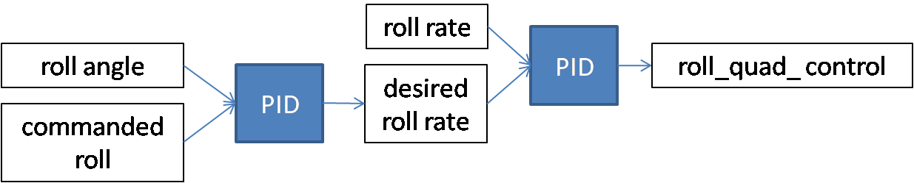
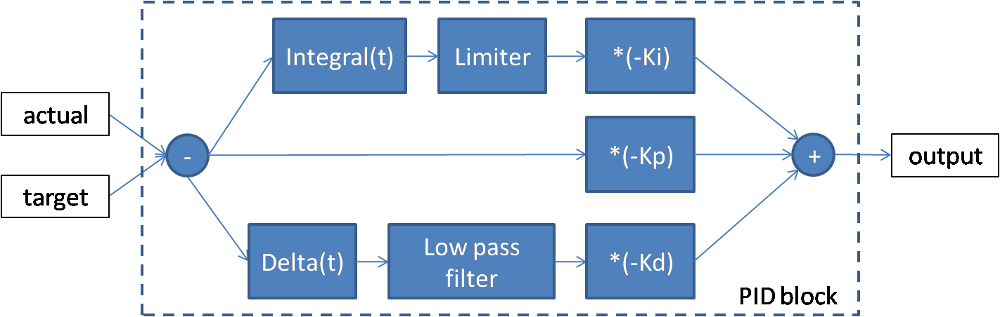

Design
######

Specifications
***************

Airframe
========

The chosen aircraft configuration is a tilt-rotor quadplane.
It is based on a 1.8m span RC glider modified to receive an arm on each wing.
Each arm is equipped with two motors. The front motors can tilt around the pitch axis.
The aerodynamics is pre-designed with PredimRC (Insert PredimRC link)

Hardware
========

The embedded hardware is based on the Open Source `MatrixPilot  <https://github.com/MatrixPilot/MatrixPilot/wiki>`_ project.
It is based on the UDB5 board, which uses a PIC16 processor architecture.

Software
========

The software is based on the MatrixPilot Open Source project version 4. This software is capable of flying automatically a conventional aircraft. Pitch, yaw and roll axis are controlled by PI controllers. An energy balance allows to control the altitude using the pitch and motor power. A GPS receiver allows waypoint navigation.
Two flight modes are implemented:
  - normal flight (conventional horizontal flight)
  - hovering flight (to fly an aerobatic aircraft capable of torque roll manoeuvre)

To ensure the flight of the quadplane, several functionalities need to be added:
  - increase of heartbeat rate and increase of output pwm frequency
  - definition of a switching condition between normal and hovering flights
  - control of the motor tilting
  - control of quadplane attitude during hovering

Increase of heartbeat rate
--------------------------

The heartbeat frequency should be at least 150 Hz.

Increase of output pwm frequency
--------------------------------

The output pwm frequency should be at least 150 Hz.

Flight modes
------------

In the MatrixPilot software, two flight modes are possible:
  - normal 
  - hovering

The condition defining the switch between these two phases is modified. It is defined as follows:
  - normal -> hovering : the motor tilt angle is greater than a given threshold (TRANSITION_MOTOR_TILT)
  - hovering -> normal : the motor tilt angle is lower than a given threshold (TRANSITION_MOTOR_TILT)

Motor tilt control
------------------

Motor tilting is commanded by a servomotor. This servomotor has a given angular range (in general 120 deg) between minimum pwm (2000) to mximum pwm (4000). The desired angular range for motor tilting on a quadplane is 90 deg (horizontal to vertical position). In order to keep maximal accuracy, motor tilting control is built such that pwm 2000 to 4000 corresponds to the desired angular range (90 deg here). In addition, in order to adjust the servo displacement to the tilting mechanism, a minimum angle, maximum angle, and offset angle are used. THe offset value determines the servo position at neutral pwm (3000). Then the minimum and maximum angles determine how much the servo is allowed to displace around the offset angle. Finally, a reversed control parameter allow to reverse the servo displacement direction.

Attitude control
----------------

An attitude control should maintain the aircraft horizontally in hovering mode.
The heading of the aircraft should also be controlled to avoid a rotation around the yaw axis (except if a yaw order is sent by the pilot).

For the roll, pitch and yaw axis, the control is based on two PID controllers for each axis.
The control around the yaw axis is illustrated below:

   Roll, pitch and yaw control

The same control structure is used on the pitch and yaw axis.
The PID controllers are constructed as shown in the following diagram:

   PID controller

So in principle, six gains, two limiting values for the integral term and two frequency cut-offs for the low pass filter (a total of ten parameters) need to be set for each axis.
However, the number of free parameters is reduced thanks to the following choices:

  - for the roll and pitch axis:

    * the Kd gain of the PID controller on the angle is set to zero
    * the Ki gain of the PID controller on the angular velocity is set to zero
    * the limit for the integral term thus reduces to one parameter operating on the PID controler on the angle
    * only one cut-off frequency is necessary for the PID controller operating on the angular velocity

    So we end up with six parameters for pitch and six parameters for roll.

  - for the yaw axis, only the proportional terms Kp are used, leading to only two parameters to set

It is necessary to deactivate the integral terms and the yaw control during take-off and just after the normal to hovering flight mode. Indeed, we do not want to accumulate errors in the integral terms during these phases. In addition, yaw control would add some instability during these particular phases.
As a result, a switch on the RC transmitter should deactivate the integral terms and reset them to zero.
Also, a potentiometer on the RC transmitter should control the level of yaw control (Kp terms), from zero to full control.
