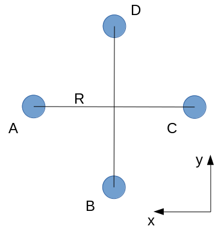
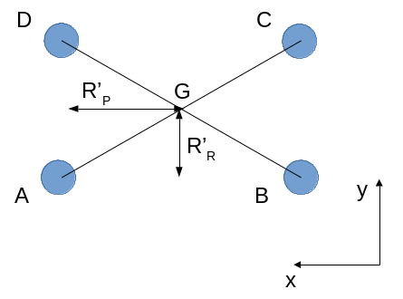
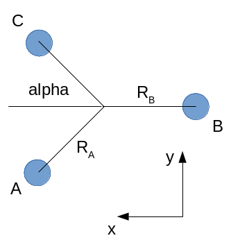

Motor control
=============

Once the roll\_quad\_control, pitch\_quad\_control and yaw\_quad\_control are computed, the final pwm outputs sent to each motor's ESC are computed as follows.
Note that the following motor control allow to obtain the same control moment for the three following motor configurations. 

The following notations are used:

  * $F_I = F_{eq_I} + \delta_{F_I}$ is the force produced by motor $I$, where $_{eq}$ is the value at equilibrium (the UAV is not moving) and $\delta_F$ is the value given by the attitude control.

  * $F$ is the sum of the (vertical) forces created by the motors.
  
  * $M$ is the sum of the moments created by the motors.

Quadcopter +
------------

Mechanical model
...............

   Quadcopter + configuration.

For a + quadcopter configuration with motor A 
at North-East (A, B, C, D being placed anticlockwise).
The center of gravity G is at the intersection of AC and BD.
We assume that motors A and C turn a counter-clockwise (CCW) propeller, and 
motors B and D a clockwise (CW) propeller.

At equilibrium, at G:

  * $F = F_{eq_A} + F_{eq_B} + F_{eq_C} + F_{eq_D} = m*g$

  * The roll moment is: $M_{roll} = R_B*(-F_{eq_B} + F_{eq_D}) = 0$.
  
  * The pitch moment is: $M_{pitch} = R_A*(F_{eq_A} - F_{eq_C}) = 0$

  * To compute the yaw moment, we apply the transport of moment from the motors to G.
    The z-component of the moment at G is equal to the z-component of the moment at the motor.
    It leads to: $M_{yaw} = -Mz_{eq_A} + Mz_{eq_B} - Mz_{eq_C} + Mz_{eq_D} = 0$,
    because a CCW propeller produces a CW moment, which is negative.
    The moments are produced by the drag of the propellers, which is proportional to $\omega^2$,
    with $\omega$ the rotating velocity of the propeller. Since the propeller thrust is also proportional to $\omega^2$, we obtain that $Mz_I = K_m * F_I$.
    Thus: $-F_{eq_A} + F_{eq_B} - F_{eq_C} + F_{eq_D} = 0$

We obtain:

  * $F_{eq_B} = F_{eq_D}$

  * $F_{eq_A} = F_{eq_C}$

  * $F_{eq_A} = F_{eq_B}$
  
Thus $F_{eq_A} = F_{eq_B} = F_{eq_C} = F_{eq_D}$ with $F_{eq_A} = m*g/4$.

Now considering roll and pitch controls:

If we impose that the pitch and roll controls have no effect on the vertical equilibrium
(\delta_{F_A} + \delta_{F_B} + \delta_{F_C} + \delta_{F_D} = 0$), 
we obtain respectively for the pitch and roll control:
  
  * $\delta_{F_B} = \delta_{F_D} = 0$, $\delta_{F_A} = -\delta_{F_C}$
      
  * $\delta_{F_A} = \delta_{F_C} = 0$, $\delta_{F_B} = -\delta_{F_D}$

It leads to:

  * $M_{roll} = R_B*(-\delta_{F_B} + \delta_{F_D}) = -2*R_B*\delta_{F_B}$
  
  * $M_{pitch} = R_A*(\delta_{F_A} - \delta_{F_C}) = 2*R_A*\delta_{F_A}$

During either a pitch or roll control, we obtain that $M_{yaw} = -\delta_{F_A} + \delta_{F_B} - \delta_{F_C} + \delta_{F_D} = 0$. So yaw is not affected by pitch and roll controls.

For yaw control, we impose that the pitch, roll and vertical equilibrium are not affected:

  * pitch control: $\delta_{F_A} = \delta_{F_C}$ and $\delta_{F_A} + \delta_{F_C} = -\delta_{F_B} - \delta_{F_D}$

  * roll control: $\delta_{F_B} = \delta_{F_D}$ and $\delta_{F_B} + \delta_{F_D} = -\delta_{F_A} - \delta_{F_C}$

So $\delta_{F_C} = \delta_{F_A}$, $\delta_{F_B} = -\delta_{F_A}$ and $\delta_{F_D} = \delta_{F_A}$ and .

Then, the relationship between the motor control (throttle) and the corresponding force produced by the propeller is $F = K*th^2$, with $K$ a coefficient depending on the propulsion chain (battery, ESC, motor and the propeller), and $th$ the throttle applied to the motor.
Considering a small throttle control around a throttle offset:
$th = th_{offset} + th_{control}$, 
then $F \approx K*2*th_{offset}*th_{control} = K_1*th_{control}$.

As a result:

  * $M_{roll} = -2*R_B*K_1*th_{{control}_B}$ with $th_{{control}_D} = -th_{{control}_B}$, the two other $th_{control}$ being zero.
  
  * $M_{pitch} = 2*R_A*K_1*th_{{control}_A}$ with $th_{{control}_C} = -th_{{control}_A}$, the two other $th_{control}$ being zero.

  * $M_{yaw} = -4*K_m*K_1*th_{{control}_A}$, with $th_{{control}_C} = th_{{control}_A}$, $th_{{control}_B} = -th_{{control}_A}$ and $th_{{control}_D} = -th_{{control}_A}$.

Implementation
..............

Based on the above mechanical model, we can compute pitch and roll control in the quadplane body frame as follows:

  - :math:`pitch\_body\_frame\_control = (R/R_B)*pitch\_quad\_control`
  - :math:`roll\_body\_frame\_control = (R/R_A)*roll\_quad\_control`

where $R$ is an equivalent arm length (typically the mean value of $R_A$ and $R_B$).
Considering that the throttle stick controls the variable $th_{offset}$, pwm outputs are:

  - 2000 if $th_{offset}$ - 3000 < MIN_THROTTLE, with MIN_THROTTLE = 0.2 * 2000
  - if $th_{offset}$ - 3000 >= MIN_THROTTLE:

    * $motor\_A = th_{offset} + yaw\_quad\_control + pitch\_body\_frame\_control$
    * $motor\_B = th_{offset} - yaw\_quad\_control - roll\_body\_frame\_control$
    * $motor\_C = th_{offset} + yaw\_quad\_control - pitch\_body\_frame\_control$
    * $motor\_D = th_{offset} - yaw\_quad\_control + roll\_body\_frame\_control$

For such a control:

  * $M_{roll} = -2*R_B*K_1*roll\_body\_frame\_control = 2*R*K_1*roll\_quad\_control$

  * $M_{pitch} = 2*R_A*K_1*pitch\_body\_frame\_control = 2*R*K_1*pitch\_quad\_control$

  * $M_{yaw} = -4*K_m*K_1*yaw\_quad\_control$

Quadcopter X
------------

Mechanical model
...............

   Quadcopter X configuration.

For a X quadcopter configuration motor A 
at North-East (A, B, C, D being placed anticlockwise).
The center of gravity G is at the intersection of AC and BD.
We assume that motors A and C turn a counter-clockwise (CCW) propeller, and 
motors B and D a clockwise (CW) propeller.

At equilibrium:

  * $F = F_{eq_A} + F_{eq_B} + F_{eq_C} + F_{eq_D} = m*g$

  * The roll moment is: $M_{roll} = R_R*(-F_{eq_A}-F_{eq_B}+F_{eq_C}+F_{eq_D}) = 0$.
  
  * The pitch moment is: $M_{pitch} = R_P*(F_{eq_A}+F_{eq_D}-F_{eq_B}-F_{eq_C}) = 0$

  * Concerning the yaw moment, the same relationship as for the + configuration applies:
    $-F_{eq_A} + F_{eq_B} - F_{eq_C} + F_{eq_D} = 0$

If we multiply the roll moment equation by $R_P$, and the pitch moment equation by $R_R$, and we sum the two equations, we obtain $F_{eq_B} = F_{eq_D}$.
And if we subtract them: $F_{eq_A} = F_{eq_C}$
So the same relationships as for the + configurations are obtained, leading to 
$F_{eq_A} = F_{eq_B} = F_{eq_C} = F_{eq_D}$ with $F_{eq_A} = m*g/4$ using the yaw equation.

Then for pitch and roll controls,
imposing that the attitude control has no effect on the vertical equilibrium:
($\delta_{F_A} + \delta_{F_B} + \delta_{F_C} + \delta_{F_D} = 0$):

  * $M_{roll} = R_R*(-\delta_{F_A}-\delta_{F_B}+\delta_{F_C}+\delta_{F_D})$.
    To obtain zero pitch moment, we further have $\delta_{F_A} + \delta_{F_D} - \delta_{F_B} - \delta_{F_C} = 0$. If we add with the vertical equilibrium, we obtain: $\delta_{F_D} = -\delta_{F_A}$. And if we subtract: $\delta_{F_C} = -\delta_{F_B}$. So $M_{roll} = -2*R_R*(\delta_{F_A}+\delta_{F_B})$. Further imposing zero yaw moment, we obtain $-\delta_{F_A} + \delta_{F_B} - \delta_{F_C} + \delta_{F_D} = 0$, which leads to $\delta_{F_A} = \delta_{F_B}$. Thus:
    $M_{roll} = -4*R_R*\delta_{F_A} = -4*R_R*K_1*th_{{control}_A}$, with $th_{{control}_B} = th_{{control}_A}$, $th_{{control}_C} = -th_{{control}_A}$ and $th_{{control}_D} = -th_{{control}_A}$. 

  * the same derivation for the pitch moment leads to $M_{pitch} = 4*R_P*\delta_{F_A} = 4*R_P*K_1*th_{{control}_A}$, with $th_{{control}_B} = -th_{{control}_A}$, $th_{{control}_C} = -th_{{control}_A}$ and $th_{{control}_D} = th_{{control}_A}$. 

  * $M_{yaw} = -4*K_m*K_1*th_{{control}_A}$, with $th_{{control}_C} = th_{{control}_A}$, $th_{{control}_B} = -th_{{control}_A}$ and $th_{{control}_D} = -th_{{control}_A}$.

Implementation
..............

In order to obtain the same roll and pitch moment than a + configuration for the same $pitch\_quad\_control$ and $roll\_quad\_control$, we impose:

  - $pitch\_body\_frame\_control = \frac{R}{2*R_P}*(pitch\_quad\_control - roll\_quad\_control)$
  - $roll\_body\_frame\_control = \frac{R}{2*R_R}*(pitch\_quad\_control + roll\_quad\_control)$

and considering that the throttle stick controls the variable $th_{offset}$, pwm outputs are:

  - 2000 if $th_{offset}$ - 3000 < MIN_THROTTLE, with MIN_THROTTLE = 0.2 * 2000
  - if $th_{offset}$ - 3000 >= MIN_THROTTLE:

    * $motor\_A = th_{offset} + yaw\_quad\_control + pitch\_body\_frame\_control$
    * $motor\_B = th_{offset} - yaw\_quad\_control - roll\_body\_frame\_control$
    * $motor\_C = th_{offset} + yaw\_quad\_control - pitch\_body\_frame\_control$
    * $motor\_D = th_{offset} - yaw\_quad\_control + roll\_body\_frame\_control$

The advantage of the $\frac{R}{2*R_P}$ and $\frac{R}{2*R_R}$ coefficients is that the same PID gains ensure the same control force for both configurations. Provided that the mass and mass distribution between the two configurations are close, the same stability will be obtained for both configurations keeping the same PID gains. 
The main objective is to avoid or limit as much as possible PID gain tuning when changing motor configuration.

Tricopter
---------

Mechanical model
...............

   Tricopter configuration.

We consider a tricopter configuration with a front arm of length $R_A$ and a rear arm length $R_B$.
The center of gravity is at the intersection of the arms.
Propeller A is CCW, propeller B is CCW and propeller C is CW.
Since there are only three motors, the yaw moment cannot be controlled by a difference in motor rotation velocity. A tilt mechanism is necessary. 
Here, the yaw moment is applied by tilting in the opposite direction the two front motors.
We call $\beta$ the tilt angle of a front motor with the vertical axis. $\beta$ positive means the motor tilts forward.

At equilibrium:

  * $F = F_{eq_A} + F_{eq_B} + F_{eq_C} = m*g$

  * The roll moment is: $M_{roll} = R_A*sin(\alpha)*(-F_{eq_A}+F_{eq_C}) = 0$
  
  * The pitch moment is: $M_{pitch} = 2*R_A*cos(\alpha)*F_{eq_A} - R_B*F_{eq_B} = 0$

  * The yaw moment is, for $\beta=0$: $M_{yaw} = -Mz_{eq_A} - Mz_{eq_B} + Mz_{eq_C}
    = K_m * (-F_{eq_A} - F_{eq_B} + F_{eq_C})$

Note that there are four equations and only three unknow forces.
So the yaw moment cannot be imposed to zero if the vertical,
pitch and roll moment equilibrium are imposed. With this choice, we obtain:

  * $F_{eq_A} = F_{eq_C}$

  * $F_{eq_B} = \frac{2*R_A*cos(\alpha)}{R_B}*F_{eq_A}$

  * $2*(1 + \frac{R_A*cos(\alpha)}{R_B})*F_{eq_A} = m*g$

  * $M_{yaw} = -K_m * F_{eq_B}$

Then, for pitch and roll controls:

  * $M_{roll} = R_A*sin(\alpha)*cos(\beta)*(-\delta_{F_A} + \delta_{F_C})$.
    To ensure a constant thrust, we impose that $\delta_{F_A} = -\delta_{F_C}$.
    We also would like the roll moment to be equal to a quadcopter configuration of arm length R:

    .. math:: M_{roll} = -2*R*K_1*roll\_quad\_control
       :label: eq_roll_equiv_r
       
    with $R$ being the tricopter averaged arm length $R = \frac{1}{3}*(2*R_A+R_B)$.

    Thus, we can pose: $M_{roll} = 2*R_A*sin(\alpha)*cos(\beta)*K_1*th_{{control}_A}$, with $th_{{control}_A} = -K_{roll}*roll\_quad\_control$, $th_{{control}_C} = -th_{{control}_A}$, $th_{{control}_B} = 0$ 
    and $K_{roll} = \frac{R}{R_A*sin(\alpha)}$, which allows to fulfill equation :math:numref:`eq_roll_equiv_r`. For small $\beta$, $cos(\beta) \approx 1-\beta$.

  * $M_{pitch} = 2*R_A*cos(\alpha)*cos(\beta)*\delta_{F_A} - R_B*\delta_{F_B}$.
    To ensure a constant thrust, we impose that $\delta_{F_B} = -2*\delta_{F_A}$.
    We also would like the pitch moment to be equal to a quadcopter configuration of arm length R:

    .. math:: M_{pitch} = 2*R*K_1*pitch\_quad\_control
       :label: eq_pitch_equiv_r

    Thus, $M_{pitch} = 2*(R_A*cos(\alpha)*cos(\beta) + R_B)*K_1*th_{{control}_A}$ with $th_{{control}_A} = K_{pitch}*pitch\_quad\_control$, $th_{{control}_B} = -2*th_{{control}_A}$, $th_{{control}_C} = th_{{control}_A}$ and $K_{pitch} = \frac{R}{2*(R_A*cos(\alpha)*cos(\beta)+R_B)}$, which fulfills equation :math:numref:`eq_pitch_equiv_r`. For small $\beta$, $cos(\beta) \approx 1-\beta$.

  * Assuming that the front motor tilt in the opposite direction:
    $M_{yaw} = sin(\beta)*(F_{eq_A}+\delta_{F_A}+F_{eq_C}+\delta_{F_C})*R_A*sin(\alpha)$.
    Assuming that the control orders are small compared to the total forces ($\delta_{F_I} << F_{eq_I}$): $M_{yaw} = sin(\beta)*2*F_{eq_A}*R_A*sin(\alpha)$. For small $\beta$, $sin(\beta) \approx \beta$. Finally, $M_{yaw} = \beta*2*F_{eq_A}*R_A*sin(\alpha)$.

Implementation
..............

For pitch and roll control:

Considering that the throttle stick controls the variable $th_{offset}$, pwm outputs are:

  - 2000 if $th_{offset} - 3000 < MIN_THROTTLE, with MIN_THROTTLE = 0.2 * 2000
  - if $th_{offset}$ - 3000 >= MIN_THROTTLE:

    * $th_{{control}_A} = \frac{R}{2*R_A*cos(\alpha)*(1-\beta)+R_B}*pitch\_quad\_control - \frac{R}{R_A*sin(\alpha)}*roll\_quad\_control$
    * $th_{{control}_B} = -2*\frac{R}{2*R_A*cos(\alpha)*(1-\beta)+R_B}*pitch\_quad\_control$
    * $th_{{control}_C} = \frac{R}{2*R_A*cos(\alpha)*(1-\beta)+R_B}*pitch\_quad\_control + \frac{R}{R_A*sin(\alpha)}*roll\_quad\_control$

    * $motor\_A = th_{offset} + th_{{control}_A}$
    * $motor\_B = th_{offset} + th_{{control}_B}$
    * $motor\_C = th_{offset} + th_{{control}_C}$

For yaw control:

A maximum tilt angle is first defined in pwm unit (1000 means full servo range).
The motor tilt is then computed as:
$yaw\_motor\_tilt\_pwm = \frac{TILT\_YAW\_LIMIT\_PWM}{1000} * yaw\_quad\_control$.
with $TILT\_YAW\_LIMIT\_PWM = TILT\_YAW\_LIMIT\_DEG \frac{1000}{MOTOR\_PITCH\_SERVO\_RANGE}$.
$yaw\_motor\_tilt\_pwm$ is then added to $motor\_pitch\_pwm$ (see :ref:`motor_tilt`).

The corresponding tilt angle $\beta$ in rad is: $\beta = \frac{\pi}{180} yaw\_motor\_tilt\_pwm \frac{MOTOR\_PITCH\_SERVO\_RANGE}{1000}$.
The coefficient $\frac{1}{1-\beta}$ is then applied to $th_{{control}_A}$ and $th_{{control}_C}$.

