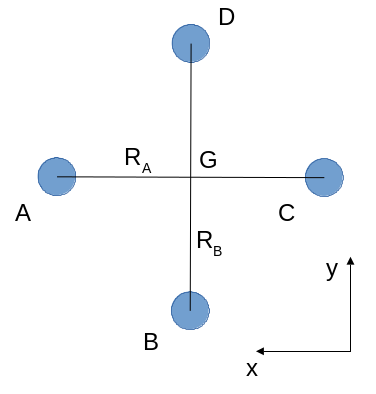
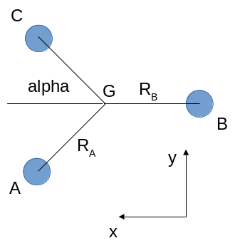

Motor control
=============

Once the roll\_quad\_control, pitch\_quad\_control and yaw\_quad\_control are computed, the final pwm outputs sent to each motor's ESC are computed as follows.
Note that the following motor control allow to obtain the same control moment for the three following motor configurations. 

Quadcopter +
------------

Mecanical model
...............

   Quadcopter + configuration.

For a + quadcopter configuration with an arm of length R and motor A 
at North-East (A, B, C, D being placed anticlockwise).

  * The roll moment is: $M_{roll} = R*(-F_B + F_D)$ with $F_I$ the thrust of motor I along the z diretion.
    In order to avoid spurious effects during roll or pitch control, we impose that the total thrust $T = F_A + F_B + F_C + F_D$ remain constant. Thus we impose that $F_D + F_B$ remains constant, and that $F_A$ and $F_C$ remain constants.

  * The pitch moment is: $M_{pitch} = R*(F_A - F_C)$
    In order to ensure a constant total thrust, we impose that $F_C + F_A$ remains constant, and that $F_A$ and $F_C$ remain constants.

Then, the relationship between the motor control (throttle) and the corresponding force produced by the propeller is $F = K*th^2$, with $K$ a coefficient depending on the propulsion chain (battery, ESC, motor and the propeller), and $th$ the throttle applied to the motor.
Considering a small throttle control around a throttle offset:
$th = th_{offset} + th_{control}$, 
then $F \approx K*2*th_{offset}*th_{control} = K_1*th_{control}$.

As a result:

  * $M_{roll} = -2*R*K_1*th_{{control}_B}$ with $th_{{control}_D} = -th_{{control}_B}$, the two other $th_{control}$ being zero.
  
  * $M_{pitch} = 2*R*K_1*th_{{control}_A}$ with $th_{{control}_C} = -th_{{control}_A}$, the two other $th_{control}$ being zero.

Implementation
..............

Based on the above mecanical model, we can compute pitch and roll control in the quadplane body frame as follows:

  - :math:`pitch\_body\_frame\_control = pitch\_quad\_control`
  - :math:`roll\_body\_frame\_control = roll\_quad\_control`

And considering that the throttle stick controls the variable $th_{offset}$, pwm outputs are:

  - 2000 if $th_{offset}$ - 3000 < MIN_THROTTLE, with MIN_THROTTLE = 0.2 * 2000
  - if $th_{offset}$ - 3000 >= MIN_THROTTLE:

    * $motor\_A = th_{offset} + yaw\_quad\_control + pitch\_body\_frame\_control$
    * $motor\_B = th_{offset} - yaw\_quad\_control - roll\_body\_frame\_control$
    * $motor\_C = th_{offset} + yaw\_quad\_control - pitch\_body\_frame\_control$
    * $motor\_D = th_{offset} - yaw\_quad\_control + roll\_body\_frame\_control$

For such a control:

  * $M_{roll} = -2*R*K_1*roll\_body\_frame\_control = 2*R*K_1*roll\_quad\_control$.

  * $M_{pitch} = 2*R*K_1*pitch\_body\_frame\_control = 2*R*K_1*pitch\_quad\_control$.

Quadcopter X
------------

Mecanical model
...............

   Quadcopter X configuration.

For an X quadcopter configuration with an arm of length R:

  * the roll moment is: $M_{roll} = \frac{1}{\sqrt{2}}*R*(-F_A - F_B + F_C + F_D)$.
    In order to ensure a constant total thrust, we impose: $th_{{control}_B} = th_{{control}_A}$, $th_{{control}_C} = -th_{{control}_A}$, $th_{{control}_D} = -th_{{control}_A}$.
    As a result: $M_{roll} = -4*\frac{1}{\sqrt{2}}*R*K_1*th_{{control}_A} = -2*\frac{2}{\sqrt{2}}*R*K_1*th_{{control}_A}$

  * the pitch moment is: $M_{pitch} = \frac{1}{\sqrt{2}}*R*(F_A + F_C - F_B - F_D)$. 
    In order to ensure a constant total thrust, we impose: $th_{{control}_C} = th_{{control}_A}$, $th_{{control}_B} = -th_{{control}_A}$, $th_{{control}_D} = -th_{{control}_A}$.
    As a result: $M_{pitch} = 2*\frac{2}{\sqrt{2}}*R*K_1*th_{{control}_A}$ 

Implementation
..............

  - :math:`pitch\_body\_frame\_control = 0.707*(pitch\_quad\_control - roll\_quad\_control)`
  - :math:`roll\_body\_frame\_control = 0.707*(pitch\_quad\_control + roll\_quad\_control)`

and considering that the throttle stick controls the variable $th_{offset}$, pwm outputs are:

  - 2000 if $th_{offset}$ - 3000 < MIN_THROTTLE, with MIN_THROTTLE = 0.2 * 2000
  - if $th_{offset}$ - 3000 >= MIN_THROTTLE:

    * $motor\_A = th_{offset} + yaw\_quad\_control + pitch\_body\_frame\_control$
    * $motor\_B = th_{offset} - yaw\_quad\_control - roll\_body\_frame\_control$
    * $motor\_C = th_{offset} + yaw\_quad\_control - pitch\_body\_frame\_control$
    * $motor\_D = th_{offset} - yaw\_quad\_control + roll\_body\_frame\_control$

Omitting the yaw control term, we obtain:

  * $motor\_A = th_{offset} + 0.707*pitch\_quad\_control - 0.707*roll\_quad\_control$

  * $motor\_B = th_{offset} - 0.707*pitch\_quad\_control - 0.707*roll\_quad\_control$

  * $motor\_C = th_{offset} - 0.707*pitch\_quad\_control + 0.707*roll\_quad\_control$

  * $motor\_D = th_{offset} + 0.707*pitch\_quad\_control + 0.707*roll\_quad\_control$

This control ensures that the total thrust remains constant.

For such a control, $M_{roll} = 2*\frac{2}{\sqrt{2}}*R*K_1*roll\_body\_frame\_control = 2*\frac{2}{\sqrt{2}}*R*K_1*0.707*roll\_quad\_control = 2*R*K_1*roll\_quad\_control$.
So thanks to the $0.707$ coefficient, we obtain the same moment as for the quadcopter + configuration.

The advantage is that the same PID gains ensure the same control force for both configurations. Provided that the mass and mass distribution between the two configurations are close, the same stability will be obtained for both configurations keeping the PID gains. 
The main objective is to avoid or limit as much as possible PID gain tuning when changing motor configuration.

Tricopter
---------

Mecanical model
...............

   Tricopter configuration.

For a tricopter configuration with a front arm of length $R_A$ and a rear arm length $R_B$:

  * the roll moment is: $M_{roll} = R_A*sin(\alpha)*(-F_A + F_C)$.
    To ensure a constant thrust, we impose that $F_A + F_C$ remains constant.
    We also would like the roll moment to be equal to a quadcopter configuration of arm length R:
    $M_{roll} = -2*R*K_1*roll\_quad\_control$, with $R$ being the tricopter averaged arm length $R = \frac{1}{3}*(2*R_A+R_B)$.
    Thus, we can pose: $M_{roll} = 2*R_A*sin(\alpha)*K_1*th_{{control}_A}$, with $th_{{control}_C} = -th_{{control}_A}$, $th_{{control}_B} = 0$ and $th_{{control}_A} = -K_{roll}*roll\_quad\_control$, with $K_{roll} = \frac{R}{R_A*sin(\alpha)}$, which fulfills all the above conditions.

  * the pitch moment is: $M_{pitch} = 2*R_A*cos(\alpha)*F_A - R_B*F_B$, with $F_A = K_1*(th_{offset}+th_{{control}_A})$, $F_B = K_1*(th_{offset}+th_{{control}_B})$ and $F_C = F_A$.
    To ensure a constant thrust, we impose that $2*F_A+F_B$ remains constant. Thus, $2*th_{{control}_A}+th_{{control}_B}=0$, or $th_{{control}_B} = -2*th_{{control}_A}$.
    We also would like the pitch moment to be equal to a quadcopter configuration of arm length R:
    $M_{pitch} = 2*R*K_1*pitch\_quad\_control$.
    Thus, $M_{pitch} = 4*R_A*cos(\alpha)*K_1*th_{{control}_A}$ with $th_{{control}_B} = 3 * th_{offset} - 2*th_{{control}_A}$, $th_{{control}_C} = th_{{control}_A}$ and $th_{{control}_A} = K_{pitch}*pitch\_quad\_control$ with $K_{pitch} = \frac{R}{2*R_A*cos(\alpha)}$.

Considering that the throttle stick controls the variable $th_{offset}$, pwm outputs are:

  - 2000 if $th_{offset} - 3000 < MIN_THROTTLE, with MIN_THROTTLE = 0.2 * 2000
  - if $th_{offset}$ - 3000 >= MIN_THROTTLE:

    * $th_{{control}_A} = \frac{R}{2*R_A*cos(\alpha)}*pitch\_quad\_control - \frac{R}{R_A*sin(\alpha)}*roll\_quad\_control$
    * $th_{{control}_B} = -2*\frac{R}{2*R_A*cos(\alpha)}*pitch\_quad\_control$
    * $th_{{control}_C} = \frac{R}{2*R_A*cos(\alpha)}*pitch\_quad\_control + \frac{R}{R_A*sin(\alpha)}*roll\_quad\_control$

    * $motor\_A = th_{offset} + th_{{control}_A}$
    * $motor\_B = th_{offset} + th_{{control}_B}$
    * $motor\_C = th_{offset} + th_{{control}_C}$

