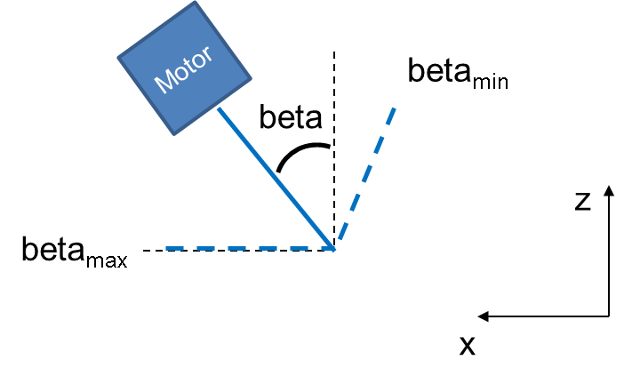

Software
========

The software is based on the MatrixPilot Open Source project version 4. This software is capable of flying automatically a conventional aircraft. Pitch, yaw and roll axis are controlled by PI controllers. An energy balance allows to control the altitude using the pitch and motor power. A GPS receiver allows waypoint navigation.
Two flight modes are implemented:

  - normal flight (conventional horizontal flight)
  - hovering flight (to fly an aerobatic aircraft capable of torque roll manoeuvre)

To ensure the flight of the quadplane, several functionalities need to be added:

  - increase of heartbeat rate and increase of output pwm frequency
  - definition of a switching condition between normal and hovering flights
  - control of the motor tilting
  - control of quadplane attitude during hovering

Conventions
-----------

The raw pwm inputs and the final pwm outputs range between $[2000; 4000]$.
However, computations are performed in practice on scaled pwm values such that neutral position corresponds to zero pwm. 
In the following, the pwm values that will be manipulated are scaled to range between $[-1000; 1000]$ for all channels except for the motor throttle which ranges between $[0; 2000]$. 

Subscript $_{eq}$ denotes the equilibrium state of the tricopter (zero forces and moments).
Subscript $_{usr}$ denotes a user input.

Increase of heartbeat rate
--------------------------

The heartbeat frequency should be at least 150 Hz.

Increase of output pwm frequency
--------------------------------

The output pwm frequency should be at least 150 Hz.

Flight modes
------------

In the MatrixPilot software, two flight modes are possible:

  - normal
  - hovering

The condition defining the switch between these two phases is modified. It is defined as follows:

  - normal -> hovering : the motor tilt angle is greater than a given threshold (TRANSITION_MOTOR_TILT)
  - hovering -> normal : the motor tilt angle is lower than a given threshold (TRANSITION_MOTOR_TILT)

.. _motor_tilt:

Motor tilt control
------------------

   Motor tilting. $\beta$ is the tilt angle in rad. $\beta=0$ corresponds to the vertical position.

Motor tilting is commanded by a servomotor. This servomotor has a given angular range (in general $120^{\circ}$ between minimum pwm (2000) to maximum pwm (4000). The desired motor tilt angle range between $TILT\_MIN\_ANGLE\_DEG$ and $TILT\_MAX\_ANGLE\_DEG$. Note that $TILT\_MIN\_ANGLE\_DEG$ needs to be a small negative angle in order to allow yaw control (see :ref:`tri_attitude_control`), so the tilt angular range is around $100^{\circ}$. In order to keep maximal accuracy, we impose that the anglular range corrresponds to the full pwm range $[2000;4000]$. In addition to $TILT\_MIN\_ANGLE\_DEG$ and $TILT\_MAX\_ANGLE\_DEG$, we introduce:

  * a coefficient $TILT\_THROW\_RATIO$ to control the angular amplitude of the servomotor
  * a reversed control parameter allows to control the servo displacement direction
  * a $TRANSITION\_ANGLE$ in radian that controls the switch between the hovering and the normal mode

.. math:: tilt\_pwm = (input\_pwm\_tilt-3000) TILT\_THROW\_RATIO
   :label: eq_manual_tilt

The final output pwm control is:

$output\_tilt\_pwm = 3000 + REVERSE\_TILT\_CONTROL * tilt\_pwm$

The relationship between the tilt angle $\beta$ and the tilt pwm is:

.. math::
  \beta \frac{180}{\pi} = \frac{TILT\_MAX\_ANGLE\_DEG - TILT\_MIN\_ANGLE\_DEG}{2000*TILT\_TRHOW\_RATIO} tilt\_pwm + \frac{TILT\_MAX\_ANGLE\_DEG + TILT\_MIN\_ANGLE\_DEG}{2}
  :label: eq_manual_tilt_angle

and conversely:

.. math::
  tilt\_pwm = \frac{1000*TILT\_THROW\_RATIO}{TILT\_MAX\_ANGLE\_DEG - TILT\_MIN\_ANGLE\_DEG} (2 \beta \frac{180}{\pi}- TILT\_MIN\_ANGLE\_DEG - TILT\_MAX\_ANGLE\_DEG)
  :label: eq_manual_tilt_pwm

The tilt pwm output corresponding to $\beta=0$ is:

.. math::
  output\_tilt\_pwm_0 = 3000 - 1000 * TILT\_THROW\_RATIO \frac{TILT\_MIN\_ANGLE\_DEG+TILT\_MAX\_ANGLE\_DEG}{TILT\_MAX\_ANGLE\_DEG-TILT\_MIN\_ANGLE\_DEG}

The hovering mode is activated if $tilt\_pwm > tilt\_pwm\_transition$, the latter being determined from :eq:`eq_manual_tilt_pwm` with $\beta=TRANSITION\_ANGLE$.

.. attitude_control::

Attitude control
----------------

.. toctree::
   :maxdepth: 2

   pid
   motor_control
