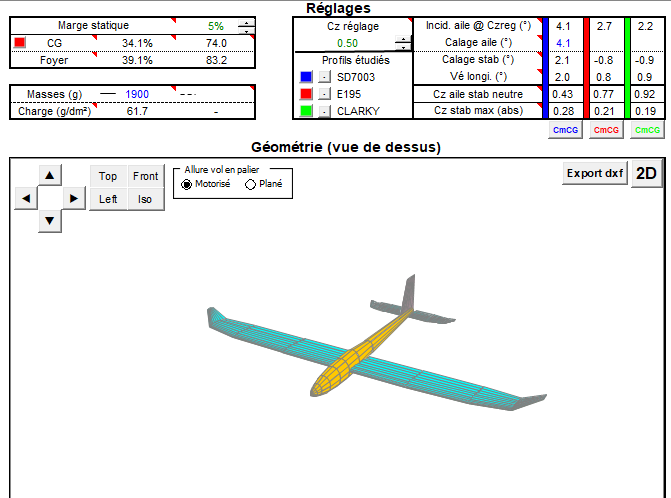
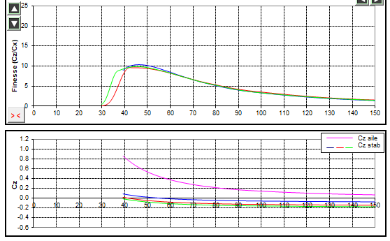
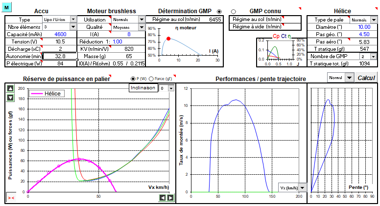

Flight mechanics model
======================

Flight mechanics model for forward flight
^^^^^^^^^^^^^^^^^^^^^^^^^^^^^^^^^^^^^^^^^

The Easyglider plane is modified due to the addition of the three motors, a tougher wing spar and the control hardware. It leads to a significant overweight compared to a conventional Easyglider (more than 800g overweight).
As a result, the aircraft flight mechanics is assessed using `PredimRC <http://rcaerolab.eklablog.com/predimrc-p1144024>`_.
*PredimRC* computes aircraft aerodynamic coeficients for a steady horizontal flight. It requires to select an airfoil, set-up the plane geometry, weight and target lift coefficient $C_z$.

The main objective is to determine the cruise speed range ensuring that the wing is working at reasonable lift coefficient. Indeed, there is a risk of stall for a too high lift coefficient. Secondly, *PredimRC* provides an estimate of the propulsion parameters during cruise, including the required electric power which is the parameter of interest to ensure that the cruise condition can be reached, and which flight time can be expected.

The set-up procedure is the following.
First, we choose three airfoils: SD7003, E195 and CLARKY. We do not know the exact airfoil of the Easyglider but we expect that these three airfoils are representative. Then we define the aircraft geometry, a weight equal to $1900g$ and the reference lift coefficient $C_z=0.5$ at which the wing is expected to work in cruise.
Based on these inputs, *PredimRC* computes interesting parameters which allow to determine the cruise speed, and geometrical parameters to obtain an aircraft that is coherent with cruise condition:

  - in terms of geometry: the center of gravity position behind the leading edge and the longitudinal V (which is the difference of angle between the wing and the horizontal stabilizer.

  - the cruise speed, which can be computed from the $C_z$ versus cruise speed graph.

  Easyglider geometry and parameters defining cruise condition.

  finesse and lift coefficient versus cruise speed.

The results show that the reference $C_z = 0.5$ is a good choice, because it is the lower $C_z$ allowing to remain at the maximum finesse.
For this $C_z$, the estimated cruise speed s $53 km/h$.
The center of gravity is $74mm$ behind the leading edge, which remains close to the value of $70mm$ given by the Easyglider manual.
One question is to know if we need to modify the Easyglider structure (wing incidence and horizontal stabilizer indicence) to match this cruise condition.
The longitudinal V, wing incidence and horizontal stabilizer indicence do not depend on the aircraft weight, but only on the airfoil type and $C_z$. So the Easyglider do not need to be modified if we assume that it is well designed for a $C_z$ of 0.5. Note that *PredimRC* estimates that the standard Easyglider (weight of $1000g$) has a cruise speed of $35 km/h$ at $C_z=0.5$.
The main result is that:

  - no modification of the Easyglider is needed

  - the cruise speed is $53 km/h$. 

  - a speed below $40 km/h$ is dangerous since the $C_z$ gets higher than $0.8$.

These parameters are needed by $ArduPilot$ to ensure that the aircraft will fly in safe conditions.

Another useful result from *PredimRC* is the required electrical power in cruise.

  Propulsion parameters in cruise condition.

Note that the fact that we use the same propeller for hovering and cruise means that we lose significant efficiency in one of the flight mode.
Here we choose low pitch propellers adapted for hovering (10x4.5 inches).
However, *PredimRC* shows that in cruise, the propeller is working far from its maximum efficiency.
As a result, a total electrical power of $84W$ is required for a cruise speed of $53 km/h$.

.. note::

  In horizontal flight, this aircraft is a bimotor (the propulsion is ensured by the two front motors).

.. note::

  *PredimRC* estimates that the maximum propeller efficiency is obtained with 10x8 propellers for a cruise speed of $53 km/h$, with a total electrical power of $63W$ (which is 25% lower than with 10x4.5 propellers).
