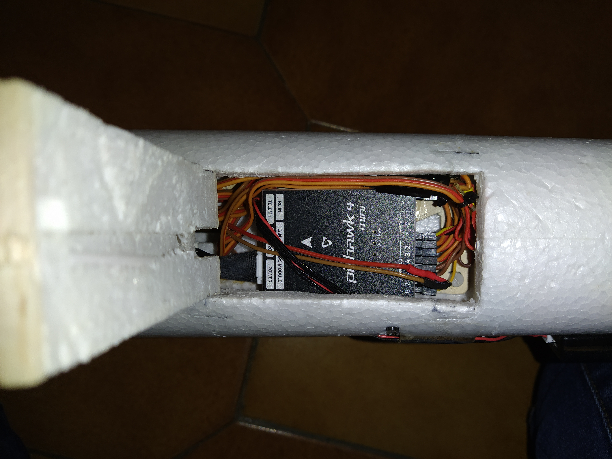

Hardware
========

Propulsion
----------

Energy is provided by two LiPo batteries 3S 2400mAh connected in parallel.

.. note::

  To obtain correct center of gravity, the two batteries would need to be placed above the R/C receiver.
  Due to a lack of space, the battery location is awkward, with one battery in the nose and the second one above the wing.

All the electronics is fed with a 5.5V converter module placed behind the RC receiver.

The motors are T-MOTOR MS2216-9, with a KV of 1100. The ESC are EMAX 25A SimonK. The propellers are 10x4.5 inch Aeronaut CAM Carbon light.

Control board
-------------

The control board is a mini Pixhawk 4, complemented with its GPS module.

  The mini pixhawk board is mounted in the fuselage, below the wing.

Communication
-------------

Telemetry communication is ensured with a Holybro 433MHz telemetry module.
