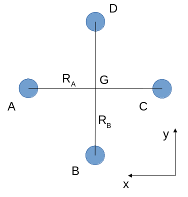
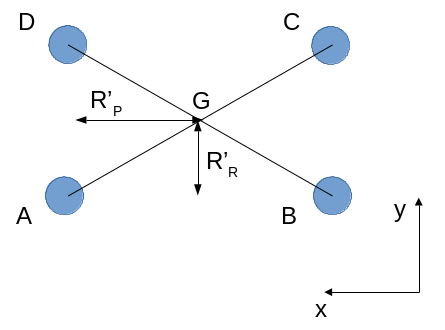

Appendices
==========

Once the roll\_quad\_control, pitch\_quad\_control and yaw\_quad\_control are computed, the final pwm outputs sent to each motor's ESC are computed as follows.
Note that the following motor control allow to obtain the same control moment for the three following motor configurations. 

Quadcopter +
------------

Mechanical model
...............

   Quadcopter + configuration.

For a + quadcopter configuration with motor A 
at North-East (A, B, C, D being placed anticlockwise).
The center of gravity G is at the intersection of AC and BD.
We assume that motors A and C turn a counter-clockwise (CCW) propeller, and 
motors B and D a clockwise (CW) propeller.

At equilibrium, at G:

  * $F = T_{eq_A} + T_{eq_B} + T_{eq_C} + T_{eq_D} = m*g$

  * The roll moment is: $M_{roll} = R_B*(-T_{eq_B} + T_{eq_D}) = 0$.
  
  * The pitch moment is: $M_{pitch} = R_A*(T_{eq_A} - T_{eq_C}) = 0$

  * To compute the yaw moment, we apply the transport of moment from the motors to G.
    The z-component of the moment at G is equal to the z-component of the moment at the motor.
    It leads to: $M_{yaw} = -Mz_{eq_A} + Mz_{eq_B} - Mz_{eq_C} + Mz_{eq_D} = 0$,
    because a CCW propeller produces a CW moment, which is negative.
    The moments are produced by the drag of the propellers, which is proportional to $\omega^2$,
    with $\omega$ the rotating velocity of the propeller. Since the propeller thrust is also proportional to $\omega^2$, we obtain that:
    
.. math::
  Mz_I = K_Q * T_I
  :label: eq_kq

Thus: $-T_{eq_A} + T_{eq_B} - T_{eq_C} + T_{eq_D} = 0$

We obtain:

  * $T_{eq_B} = T_{eq_D}$

  * $T_{eq_A} = T_{eq_C}$

  * $T_{eq_A} = T_{eq_B}$
  
Thus $T_{eq_A} = T_{eq_B} = T_{eq_C} = T_{eq_D}$ with $T_{eq_A} = m*g/4$.

Now considering roll and pitch controls:

If we impose that the pitch and roll controls have no effect on the vertical equilibrium
($\delta_{T_A} + \delta_{T_B} + \delta_{T_C} + \delta_{T_D} = 0$), 
we obtain respectively for the pitch and roll control:
  
  * $\delta_{T_B} = \delta_{T_D} = 0$, $\delta_{T_A} = -\delta_{T_C}$
      
  * $\delta_{T_A} = \delta_{T_C} = 0$, $\delta_{T_B} = -\delta_{T_D}$

It leads to:

  * $M_{roll} = R_B*(-\delta_{T_B} + \delta_{T_D}) = -2*R_B*\delta_{T_B}$
  
  * $M_{pitch} = R_A*(\delta_{T_A} - \delta_{T_C}) = 2*R_A*\delta_{T_A}$

During either a pitch or roll control, we obtain that $M_{yaw} = -\delta_{T_A} + \delta_{T_B} - \delta_{T_C} + \delta_{T_D} = 0$. So yaw is not affected by pitch and roll controls.

For yaw control, we impose that the pitch, roll and vertical equilibrium are not affected:

  * pitch control: $\delta_{T_A} = \delta_{T_C}$ and $\delta_{T_A} + \delta_{T_C} = -\delta_{T_B} - \delta_{T_D}$

  * roll control: $\delta_{T_B} = \delta_{T_D}$ and $\delta_{T_B} + \delta_{T_D} = -\delta_{T_A} - \delta_{T_C}$

So $\delta_{T_C} = \delta_{T_A}$, $\delta_{T_B} = -\delta_{T_A}$ and $\delta_{T_D} = \delta_{T_A}$ and .

Then, the relationship between the motor control (throttle) and the corresponding force produced by the propeller is $T = K_T*th^2$, with $K_T$ a coefficient depending on the propulsion chain (battery, ESC, motor and the propeller), and $th_i$ the throttle applied to the motor i.
Considering a small throttle control around a throttle eq:
$th = th_{eq} + th_{control}$, 
then $T \approx K*2*th_{eq}*th_{control} = K_1*th_{control}$ with:

.. math::
  K_1 = K*2*th_{eq}
  :label: eq_k1

$th_{{eq}_i}$ is the same for all motors and is given by $th_{eq} =
\sqrt{\frac{m*g}{4*K_T}}$.

As a result:

  * $M_{roll} = -2*R_B*K_1*th_{{control}_B}$ with $th_{{control}_D} = -th_{{control}_B}$, the two other $th_{control}$ being zero.
  
  * $M_{pitch} = 2*R_A*K_1*th_{{control}_A}$ with $th_{{control}_C} = -th_{{control}_A}$, the two other $th_{control}$ being zero.

  * $M_{yaw} = -4*K_Q*K_1*th_{{control}_A}$, with $th_{{control}_C} = th_{{control}_A}$, $th_{{control}_B} = -th_{{control}_A}$ and $th_{{control}_D} = -th_{{control}_A}$.

Implementation
..............

Based on the above mechanical model, we can compute pitch and roll control in the quadplane body frame as follows:

  * :math:`pitch\_body\_frame\_control = (R_+/R_B)*pitch\_quad\_control`
  * :math:`roll\_body\_frame\_control = (R_+/R_A)*roll\_quad\_control`

and use the following to control each motor:

  * $th\_A = th_{eq} + yaw\_quad\_control + pitch\_body\_frame\_control$
  * $th\_B = th_{eq} - yaw\_quad\_control - roll\_body\_frame\_control$
  * $th\_C = th_{eq} + yaw\_quad\_control - pitch\_body\_frame\_control$
  * $th\_D = th_{eq} - yaw\_quad\_control + roll\_body\_frame\_control$

where $R_+$ is an equivalent arm length (typically the mean value of $R_A$ and $R_B$). The $R_+/R_A$ and $R_+/R_B$ ratios allow to use the same PID gains for both roll and pitch (assuming the same inertia around the roll and pitch axis).

For such a control:

  * $M_{roll} = -2*R_B*K_1*roll\_body\_frame\_control = 2*R*K_1*roll\_quad\_control$

  * $M_{pitch} = 2*R_A*K_1*pitch\_body\_frame\_control = 2*R*K_1*pitch\_quad\_control$

  * $M_{yaw} = -4*K_Q*K_1*yaw\_quad\_control$

Quadcopter X
------------

Mechanical model
...............

   Quadcopter X configuration.

For a X quadcopter configuration motor A 
at North-East (A, B, C, D being placed anticlockwise).
The center of gravity G is at the intersection of AC and BD.
We assume that motors A and C turn a counter-clockwise (CCW) propeller, and 
motors B and D a clockwise (CW) propeller.

At equilibrium:

  * $F = T_{eq_A} + T_{eq_B} + T_{eq_C} + T_{eq_D} = m*g$

  * The roll moment is: $M_{roll} = R_R*(-T_{eq_A}-T_{eq_B}+T_{eq_C}+T_{eq_D}) = 0$.
  
  * The pitch moment is: $M_{pitch} = R_P*(T_{eq_A}+T_{eq_D}-T_{eq_B}-T_{eq_C}) = 0$

  * Concerning the yaw moment, the same relationship as for the + configuration applies:
    $-T_{eq_A} + T_{eq_B} - T_{eq_C} + T_{eq_D} = 0$

If we multiply the roll moment equation by $R_P$, and the pitch moment equation by $R_R$, and we sum the two equations, we obtain $T_{eq_B} = T_{eq_D}$.
And if we subtract them: $T_{eq_A} = T_{eq_C}$
So the same relationships as for the + configurations are obtained, leading to 
$T_{eq_A} = T_{eq_B} = T_{eq_C} = T_{eq_D}$ with $T_{eq_A} = m*g/4$ using the yaw equation.

Then for pitch and roll controls,
imposing that the attitude control has no effect on the vertical equilibrium:
($\delta_{T_A} + \delta_{T_B} + \delta_{T_C} + \delta_{T_D} = 0$):

  * $M_{roll} = R_R*(-\delta_{T_A}-\delta_{T_B}+\delta_{T_C}+\delta_{T_D})$.
    To obtain zero pitch moment, we further have $\delta_{T_A} + \delta_{T_D} - \delta_{T_B} - \delta_{T_C} = 0$. If we add with the vertical equilibrium, we obtain: $\delta_{T_D} = -\delta_{T_A}$. And if we subtract: $\delta_{T_C} = -\delta_{T_B}$. So $M_{roll} = -2*R_R*(\delta_{T_A}+\delta_{T_B})$. Further imposing zero yaw moment, we obtain $-\delta_{T_A} + \delta_{T_B} - \delta_{T_C} + \delta_{T_D} = 0$, which leads to $\delta_{T_A} = \delta_{T_B}$. Thus:
    $M_{roll} = -4*R_R*\delta_{T_A} = -4*R_R*K_1*th_{{control}_A}$, with $th_{{control}_B} = th_{{control}_A}$, $th_{{control}_C} = -th_{{control}_A}$ and $th_{{control}_D} = -th_{{control}_A}$. 

  * the same derivation for the pitch moment leads to $M_{pitch} = 4*R_P*\delta_{T_A} = 4*R_P*K_1*th_{{control}_A}$, with $th_{{control}_B} = -th_{{control}_A}$, $th_{{control}_C} = -th_{{control}_A}$ and $th_{{control}_D} = th_{{control}_A}$. 

  * 
    .. math:: M_{yaw} = -4*K_Q*K_1*th_{{control}_A}
      :label: eq_quadx_myaw
    
    with $th_{{control}_C} = th_{{control}_A}$, $th_{{control}_B} = -th_{{control}_A}$ and $th_{{control}_D} = -th_{{control}_A}$.

Implementation
..............

In order to obtain the same roll and pitch moment than a + configuration for the same $pitch\_quad\_control$ and $roll\_quad\_control$, we impose:

  - $pitch\_body\_frame\_control = \frac{R_X}{R_P}*(pitch\_quad\_control - roll\_quad\_control)$
  - $roll\_body\_frame\_control = \frac{R_X}{R_R}*(pitch\_quad\_control + roll\_quad\_control)$

and:

  * $th\_A = th_{eq} + yaw\_quad\_control + pitch\_body\_frame\_control$
  * $th\_B = th_{eq} - yaw\_quad\_control - roll\_body\_frame\_control$
  * $th\_C = th_{eq} + yaw\_quad\_control - pitch\_body\_frame\_control$
  * $th\_D = th_{eq} - yaw\_quad\_control + roll\_body\_frame\_control$

The advantage of the $\frac{R_X}{R_P}$ and $\frac{R_X}{R_R}$ coefficients is that:

  * the same gains PID gains can be used for bot roll and pitch axis.
  * PID gains can be conserved between the + and x configurations using $R_X = R_+ / 2$. Provided that the mass and mass distribution between the two configurations are close, the same torques will be obtained for the + and x configurations, without changing the PID gains. The main objective is to avoid or limit as much as possible PID gain tuning when changing motor configuration or quadcopter geometry.

In the particular case of $R_P = R_R$, then $\frac{R_X}{R_P} = \frac{R_X}{R_P} = \sqrt{2}$ and:

  * 
     .. math::
       M_{roll} = -2*\sqrt{2}*R_X*K_1*th_{{control}_A}
       :label: eq_quadx_square_mroll

  * $M_{pitch} = -M_{roll}$
  * 
     .. math::
       M_{yaw} = -4*K_Q*K_1*yaw\_quad\_control
       :label: eq_quadx_square_myaw

