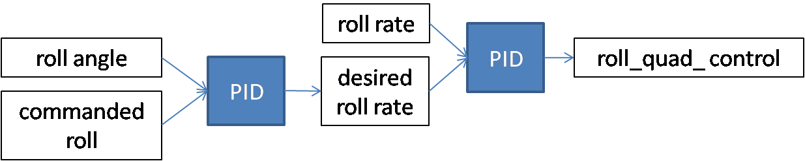

PID controllers
===============

An attitude control should maintain the aircraft horizontally in hovering mode.
The heading of the aircraft should also be controlled to avoid a rotation around the yaw axis (except if a yaw order is sent by the pilot).

PID control structure
---------------------

For the roll, pitch and yaw axis, the control is based on two PID controllers for each axis.
The control around the yaw axis is illustrated below:

   PID control for roll. The pitch and yaw follow the same model.

The same control structure is used on the pitch and yaw axis.
The PID controllers are constructed as shown in the following diagram:

.. figure:: ../figs/pid.png
   :scale: 45 %

   PID control.

So in principle, six gains, two limiting values for the integral term and two frequency cut-offs for the low pass filter (a total of ten parameters) need to be set for each axis.
However, the number of free parameters is reduced thanks to the following choices:

  - for the roll and pitch axis:

    * the Kd gain of the PID controller on the angle is set to zero
    * the Ki gain of the PID controller on the angular velocity is set to zero
    * the limit for the integral term thus reduces to one parameter operating on the PID controler on the angle
    * only one cut-off frequency is necessary for the PID controller operating on the angular velocity

    So we end up with six parameters for pitch and six parameters for roll.

  - for the yaw axis, only the proportional terms Kp are used, leading to only two parameters to set

The PID controller outputs are $roll\_quad\_control$, $pitch\_quad\_control$, $yaw\_quad\_control$.

Specific control near the ground
--------------------------------

It is necessary to deactivate the integral terms and the yaw control during take-off and just after the normal to hovering flight mode. Indeed, we do not want to accumulate errors in the integral terms during these phases. In addition, yaw control would add some instability during these particular phases.
As a result, a switch on the RC transmitter should deactivate the integral terms and reset them to zero.
Also, a potentiometer on the RC transmitter should control the level of yaw control (Kp terms), from zero to full control.
